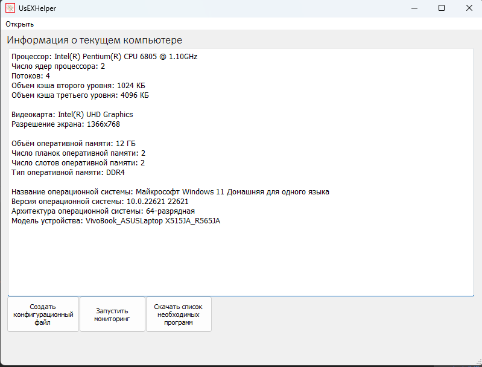
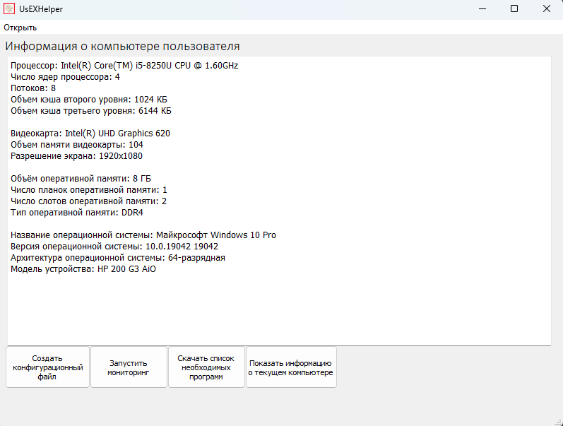
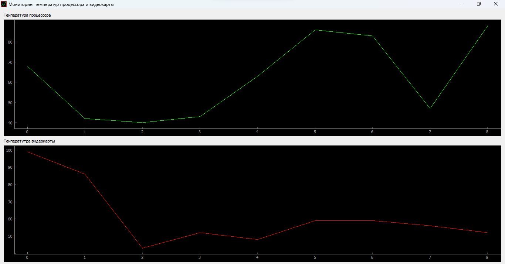

# UsExMonitoring
___
### User Experience Monitoring
## Описание
___
Программа позволяет пользователю:
1. Смотреть конфигурацию своего компьютера.
2. Сохранять файл конфигурации для последующей его отправки.
3. Устанавливать программы из заранее подготовленной таблицы формата .csv.
4. Запускать мониторинг температур, сохранять его в базу данных и отсматривать.
5. Имеется функция сравнения графиков мониторинга по датам.

## Демо-фото

## Используемые технологии
В основе графического интерфейса лежит PyQT5.

Для отрисовки графиков использую Pyqtgraph.

Для работы с базой данной - SQLite3.

Параметры компьютера получаю через WMI.

Измеряя температуру, использую программу OpenHardwareMonitor.
link: https://openhardwaremonitor.org
## Запуск из исходников

Для запуска из исходников должна быть скачана
программа OpenHardwareMonitor.
Папка с программой должна лежать рядом со всеми файлами.

Запускать main.py.

## Благодарность
подумаю